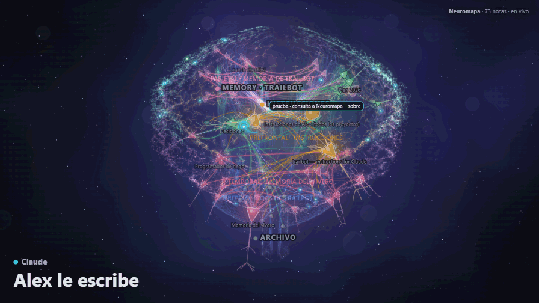

# Neuromapa

[](https://github.com/lumiel777/neuromapa/actions/workflows/pruebas.yml)

**La memoria de Claude Code como un cerebro 3D en vivo.** Un médico que avisa cuando tus notas quedaron viejas y un
buscador que le da a Claude lo que ya sabe, antes de que lo vuelva a averiguar.

*[English version](README.en.md)*



## Qué hace

- **Un mapa de tus notas.** Junta la memoria de Claude Code (`~/.claude/projects/*/memory/`), tus `CLAUDE.md` y los
  documentos que elijas, y los dibuja como un cerebro: cada nota es una neurona y cada vez que una nota nombra a otra,
  una conexión.
- **En vivo.** Mientras Claude trabaja, se ve qué nota lee, qué archivo edita, qué agente lanzó y en qué chat. Abajo,
  el río del tiempo muestra los últimos 10 minutos con una línea por chat: cada cosa que hizo, cuándo le escribiste,
  los agentes que lanzó y si está esperando tu OK.
- **Un médico.** `/neuromapa:salud` revisa la memoria: enlaces a notas que ya no existen, notas que nadie nombra,
  memorias repetidas o que el índice no lista, y encabezados incompletos. Si sumás tus proyectos al `config.json`, también
  `archivo:línea` que se corrieron, commits que no existen y notas que dicen que algo no anda cuando un commit posterior
  parece haberlo arreglado; y las cifras que cargues en `hechos.json`, el día que dejen de ser ciertas.
- **Un buscador.** `/neuromapa:sobre tema` dice qué notas leer primero, avisa los datos viejos, junta las decisiones
  anotadas que tocan el tema y nombra el código que esas notas citan, para comprobarlo antes de responder. Claude lo
  puede usar cuando quiera; con el contexto automático, le llega solo en cada pedido. En el mapa se ve por qué eligió
  cada nota: el rayo sale de un color según el motivo (tus palabras, un índice que la nombra o lo aprendido) y la nota
  lo dice, con el tramo.
- **Aprende de tu uso.** Como un cerebro: lo que se usa junto se conecta y lo que no se repite se olvida (a la mitad
  cada 14 días). Se fija qué archivos se abren juntos y si las notas que recomendó se leyeron, y con eso suma a la
  pista el código que se suele abrir con esas notas, la nota que se suele leer junto y lo que se leyó en las últimas
  horas. En el mapa, las conexiones que más se usan se engrosan, con cuentitas de luz, y los pulsos corren más rápido
  por ellas (como la mielina); lo que se usa junto sin estar enlazado aparece como conexión «Aprendida». Todo cambia
  en vivo: el camino que un chat recorre se ilumina, los nuevos nacen y los olvidados se apagan, y el bloque «Lo que
  aprendió» muestra qué está uniendo mientras Claude trabaja; `neuromapa --aprendido` lo cuenta,
  `neuromapa --aprendido archivo` dice con qué se usa ese archivo y `neuromapa --olvidar` borra una unión que no
  querés (o todo lo de un archivo). Cada uno aprende en
  su computadora, de su propio uso, y arranca sabiendo algo gracias a las charlas que Claude Code ya tenía guardadas.
- **Avisos automáticos.** Cuando Claude crea una memoria parecida a otra, cuando dos chats editan el mismo archivo,
  cuando escribe en una nota un enlace a otra nota que no existe y cuando aparece un problema nuevo en tus notas.
- **Opcional:** el contexto automático, que en cada pedido le pasa a Claude lo más útil de tus notas y, al editar un
  archivo de código, le dice cuál es la nota que se suele leer con él si todavía no la leyó (se prende en las
  [opciones](#opciones) del plugin); un freno que pregunta antes de lanzar agentes cuando los de un chat ya gastaron
  muchos tokens en la última hora (se prende en el `config.json`); y un conector para el modo Chat de la app de
  escritorio de Claude, donde los hooks no corren: le da tus notas en solo lectura y esas charlas se ven en el mapa
  (ver [cómo funciona](docs/como-funciona.md#conector-para-la-app-de-escritorio-de-claude-opcional)).

## Lo que se midió

**Primera medición:** 450 corridas reales de Claude Code (Opus y Sonnet) sobre 50 preguntas de un proyecto grande, y
30 jueces ciegos.

- Claude gastó **entre un 14 y un 18 % menos** por pregunta (con Opus, más barato en 40 de las 50).
- Menos errores graves (Opus 19 → 16, Sonnet 20 → 13) y menos datos viejos dichos como actuales (Opus 7 → 3).
- Acertó igual o algo más (Opus 82 → 86 %, Sonnet 58 → 72 %), pero esa diferencia todavía no es estadísticamente
  segura.

**Segunda medición, con esta versión:** 100 corridas de Sonnet sobre las mismas 50 preguntas, con y sin Neuromapa la
misma noche, y otros 30 jueces ciegos.

- La nota de las respuestas subió **de 6,4 a 7,0** sobre 10 (mejor en 29 preguntas, peor en 11). Esta vez la
  diferencia es estadísticamente segura (p = 0,006). Sin las 17 preguntas cuyo dato cambió desde que se escribieron
  las respuestas de referencia, sube 0,45 y ya no es segura.
- Correctas: 72 → 80 %. Esto solo todavía no es seguro.
- Errores graves: 13 → 10. Costo: un 8 % menos.

No se midieron charlas largas.

## Requisitos

- [Claude Code](https://code.claude.com).
- [Python](https://www.python.org/downloads/) 3.10 o más nuevo. No hace falta instalar nada más: usa solo lo que trae Python.
- [git](https://git-scm.com/downloads), porque Claude Code baja el plugin con git. En Windows viene con Git for
  Windows, que además hace más rápidos los hooks (sin Git Bash andan igual, con PowerShell).
- Para el mapa, un navegador con WebGL (cualquiera moderno).

## Instalar

```
claude plugin marketplace add lumiel777/neuromapa
claude plugin install neuromapa@neuromapa
```

O, adentro de una sesión de Claude Code: `/plugin marketplace add lumiel777/neuromapa` y después `/plugin install neuromapa@neuromapa`.

La primera vez que abras Claude Code después de instalarlo, Neuromapa avisa que quedó instalado y cómo abrir el mapa.
Si falta Python, lo avisa al abrir Claude Code y no hace nada hasta que lo instales. Si al instalar Claude Code
dice que hay 2 opciones sin configurar («userConfig options not yet set»), es normal: las dos tienen su valor de
fábrica y se cambian cuando quieras (ver [Opciones](#opciones)).

## Actualizar

```
claude plugin marketplace update neuromapa
claude plugin update neuromapa@neuromapa
```

Después cerrá y volvé a abrir Claude Code: la versión nueva entra recién ahí. Si el mapa estaba prendido, abrilo con
`/neuromapa:abrir --reiniciar`, porque el que sigue prendido tiene la versión de antes. Tu configuración y lo aprendido
quedan como estaban.

## Usar

| Qué | Cómo |
|---|---|
| Abrir el mapa en vivo | `/neuromapa:abrir` |
| Qué se sabe de un tema | `/neuromapa:sobre cómo decide el programador si riega` |
| Revisar la memoria | `/neuromapa:salud` |
| Probar con notas inventadas | `/neuromapa:abrir --demo` (ver [demo/LEEME.md](demo/LEEME.md)) |

Mientras el plugin está prendido, Claude tiene además el comando `neuromapa` en su consola (`neuromapa --help` lista
las opciones) y lo puede usar cuando lo necesite. En tu propia terminal ese comando no está; ahí sirve lo de [Sin instalar el plugin](#sin-instalar-el-plugin).

El mapa se apaga solo 10 minutos después de cerrar su última pestaña; si lo volvés a abrir mientras está prendido,
se reusa (con `--reiniciar` arranca uno nuevo). En el mapa, `?` muestra la ayuda y los atajos. `A` pone los nombres genéricos (modo anónimo) y `C` deja solo el cerebro
(modo cine); para mostrarlo sin enseñar tus notas, usá los dos juntos, porque el modo cine solo no esconde los nombres.

## Opciones

En `/plugin configure neuromapa@neuromapa` (o en `/config`):

- **Contexto automático en cada pedido** (`servir_contexto`), apagado de fábrica. Prendido, también le recuerda a
  Claude la nota que se suele leer con cada archivo de código que edita, y que pase a la memoria lo decidido cuando la
  charla se compacta o cuando cambió varios archivos sin anotar nada (así no se pierde en la próxima compactación).
  Aun apagado, una vez por chat le avisa a Claude
  los problemas nuevos de tus notas (rutas o enlaces rotos, memorias sin índice y posibles duplicados).
- **Carpeta de datos** (`carpeta_datos`): dónde guarda su configuración, el registro en vivo y la página. Si la dejás
  vacía, usa la carpeta propia del plugin (`~/.claude/plugins/data/neuromapa-neuromapa/`), que se borra al
  desinstalarlo. Si elegís otra, que sea solo tuya (ver [Privacidad](#privacidad)).

Sin configurar nada, Neuromapa lee la memoria de Claude Code y tus `CLAUDE.md` de `~/.claude`. Para sumar proyectos,
documentos, lóbulos o el freno de agentes, escribí un `config.json` en la carpeta de datos; el de
[demo/config.json](demo/config.json) sirve de ejemplo, y [docs/como-funciona.md](docs/como-funciona.md) explica cada campo.

## Desinstalar

```
claude plugin uninstall neuromapa@neuromapa
claude plugin marketplace remove neuromapa
```

Se borra su carpeta de datos, salvo que hayas elegido una propia en `carpeta_datos` o que desinstales con
`--keep-data`. Tus notas no se tocan: Neuromapa
nunca escribe en la memoria. Cuando encuentra un problema se lo cuenta a Claude, y es Claude quien puede arreglarlo.

## Privacidad

- **Nada sale de tu computadora.** No hay telemetría ni servidor propio. El servidor del mapa escucha solo en
  `127.0.0.1` y pide una clave. Las dos bibliotecas que usa la página (d3 y marked) vienen adentro, en `vendor/`, así
  que el mapa anda sin internet.
- **Dormir con Claude, solo si lo prendés** (`dormir_con_claude` en el `config.json`): la pasada de cada día le manda a
  Claude, con tu propio Claude Code, renglones de tus notas y los cambios de algunos commits (nunca los de archivos
  sensibles), igual que en cualquier charla, y gasta de tu cuenta hasta el tope que pongas por día.
- **Para contar tokens y errores**, `--salud`, el freno y las lecciones leen las charlas que guarda Claude Code en
  `~/.claude/projects`. No las copian ni las mandan a ningún lado. El aprendizaje también las lee una vez, para
  arrancar sabiendo algo: de cada una saca solo qué archivos se leyeron o editaron juntos, nunca lo que dicen.
- **`--charlas` busca en esas charlas solo cuando se lo pedís**: lee lo que escribiste vos y lo que respondió Claude
  (nunca lo que devolvieron las herramientas, los comandos ni lo que Claude piensa por dentro), no guarda copia ni
  índice y tapa lo que parece una clave antes de mostrarlo. Claude Code borra las charlas de la terminal a los 30 días
  (`cleanupPeriodDays`); las de la app de escritorio las guarda siempre.
- **El registro en vivo guarda rutas, tipos de herramienta y cantidades**, nunca el texto de tus mensajes, los comandos
  que corre Claude, lo que busca ni direcciones web completas. Lo de más de 90 días se borra solo (queda un resumen por
  día); se cambia con `borrar_registros_dias` en el `config.json`, y 0 es nunca.
- **Lo aprendido son rutas y números** (`en-vivo/aprendido.json`, sacado de ese registro): qué archivos se usaron juntos
  y qué notas recomendadas se leyeron. Se apaga con `"aprender": false` en el `config.json`.
- **La página (`cerebro.html`) lleva adentro el texto de tus notas**, aun en modo anónimo: no la compartas. Para mostrar
  el mapa, compartí una captura o un video hecho en modo anónimo, o la copia que baja el botón **Sin notas** (mismas
  neuronas y conexiones, nombres genéricos, sin textos ni rutas).
- **El historial (`historial/` en la carpeta de datos) guarda cada versión de tus notas de memoria**, para que nada de
  lo que se borre se pierda. Queda en tu PC, nace cerrado para tu cuenta y, como la página, no se comparte. No guarda
  los archivos delicados por el nombre (`.env`, `id_rsa`, `.ssh/`…) ni las carpetas ocultas. Lo que entra queda en las
  versiones viejas: si alguna vez anotaste algo que no tendría que estar, borrá la carpeta `historial/` y vuelve a
  empezar desde ahí.
- Lo que Claude lee de Neuromapa va a Anthropic como cualquier archivo que Claude abre.
- **La carpeta de datos tiene que ser solo tuya**, no una compartida ni la raíz de un disco que usan otras cuentas de la
  PC: quien pueda escribir ahí puede cambiar lo que Neuromapa le pasa a Claude. Las carpetas que crea Neuromapa nacen
  cerradas para tu cuenta, y `/neuromapa:salud` avisa (con el comando para cerrarla) si otra cuenta puede escribir en
  la carpeta de datos o en la del programa.

## Sin instalar el plugin

```
git clone https://github.com/lumiel777/neuromapa neuromapa
cd neuromapa
sh bin/neuromapa abrir --demo
```

En Windows, desde PowerShell o `cmd`: `bin\neuromapa.cmd abrir --demo`. Cada lanzador busca solo un Python 3.10 o más
nuevo: `bin/neuromapa` prueba `python3`, `python` y `py`, y `bin\neuromapa.cmd` prueba `py -3` y `python`.
`sh bin/neuromapa --help` (o `bin\neuromapa.cmd --help`) lista todo lo que hace la consola, y
`python3 herramientas/prueba_humo.py` (en Windows, `py -3 herramientas/prueba_humo.py`) corre las pruebas sin tocar
nada tuyo.

Sin el plugin no hay hooks: el mapa muestra tus notas, pero no se ve lo que hacen los chats en vivo, no aprende de eso
y Claude no recibe los avisos ni el contexto automático. Para eso, instalá el plugin.

## Estado

Versión 0.1, en prueba. Probado en Windows y en Linux; en Mac todavía no. Si te invitaron a probarlo, seguí
[docs/probar.md](docs/probar.md). Si algo falla, abrí un issue; si es de seguridad, mirá [SECURITY.md](SECURITY.md).
Para colaborar, [CONTRIBUTING.md](CONTRIBUTING.md); los cambios de cada versión, en [CHANGELOG.md](CHANGELOG.md).

## Licencia

[MIT](LICENSE). Trae adentro d3 (ISC) y marked (MIT), sin cambios: ver [vendor/LICENCIAS.md](vendor/LICENCIAS.md).
